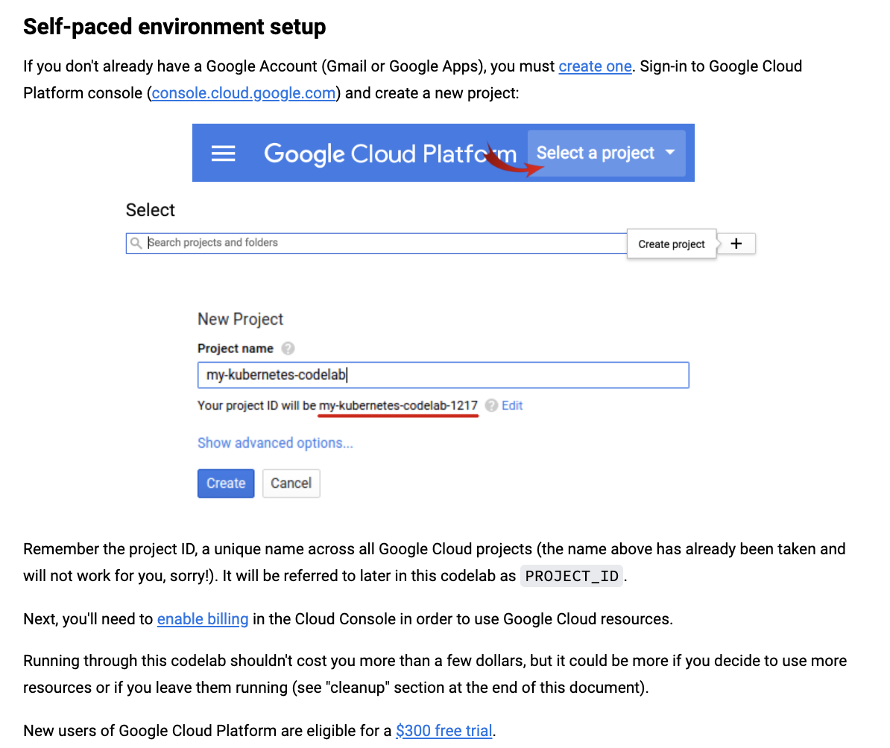
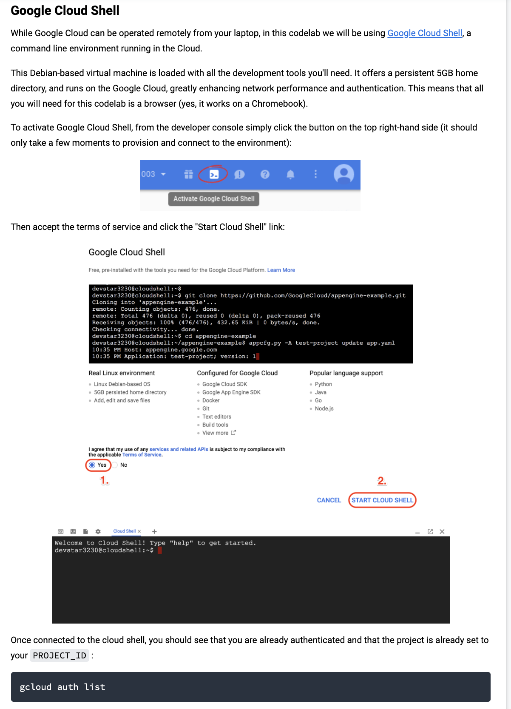
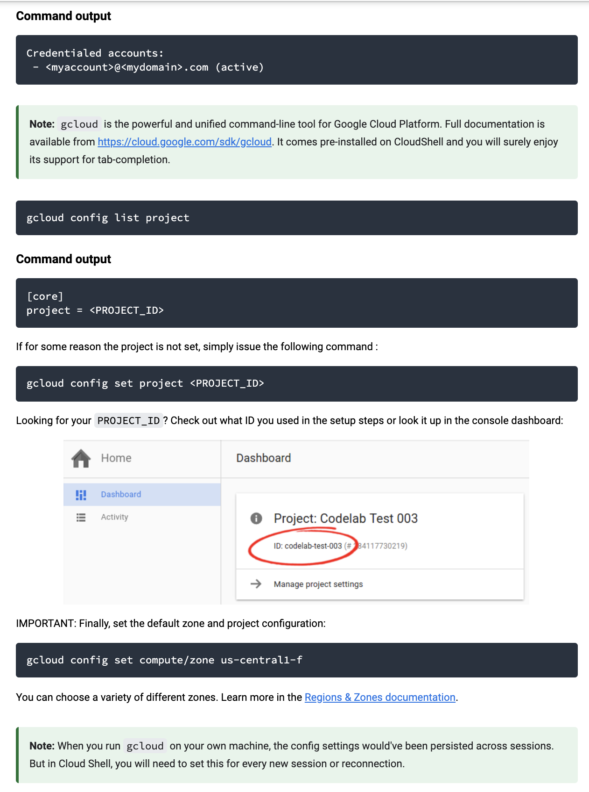

## Overview
Practice using GKE (Google Kubernetes Engine) with various features and workflows. From the perspective of a developer, meaning this excludes most devops workflows. 

All based on the GCP codelabs. This includes various parts of the labs that I found most useful, in a condensed, hopefully consumable format.

### Orchestrate with Kubernetes
Includes steps to:
* Create cluster
* Create pods
* Create services
* Create, expose, and scale deployments
* Configure networking between nodes

### Cloudrun on GKE
Includes steps to:
* Setup a cloudrun-enabled cluster
* Deploy to cloudrun on GKE
* Access the deployed service

### Batch jobs on GKE
Includes steps to:
* Create jobs
* Run jobs with dependencies

### General Setup
* To setup the google cloud sdk https://cloud.google.com/sdk/docs/downloads-interactive
* To setup kubectl [install-and-configure-kubectl.md](orchestrate-with-kubernetes/setup/install-and-configure-kubectl.md)
* To setup the Cloud Shell 

