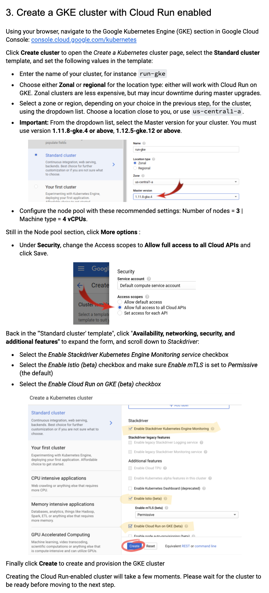
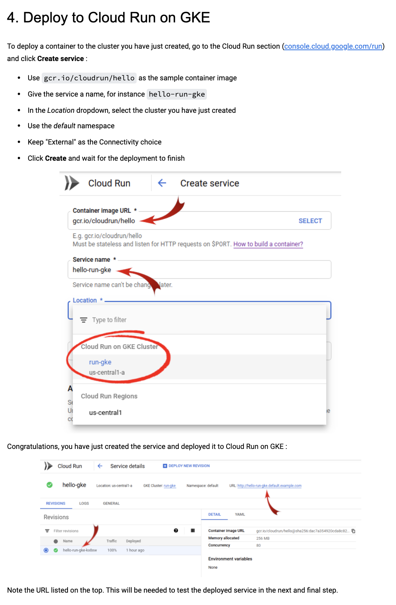
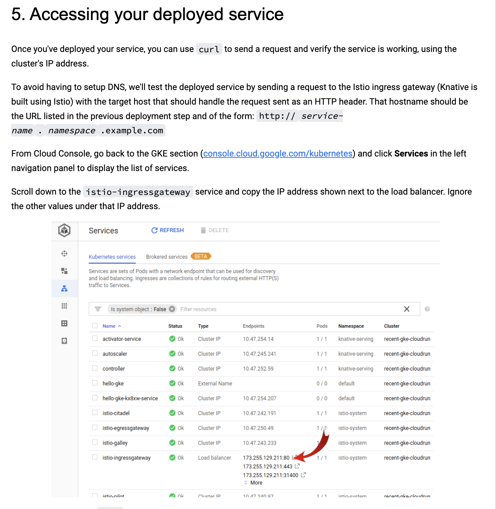
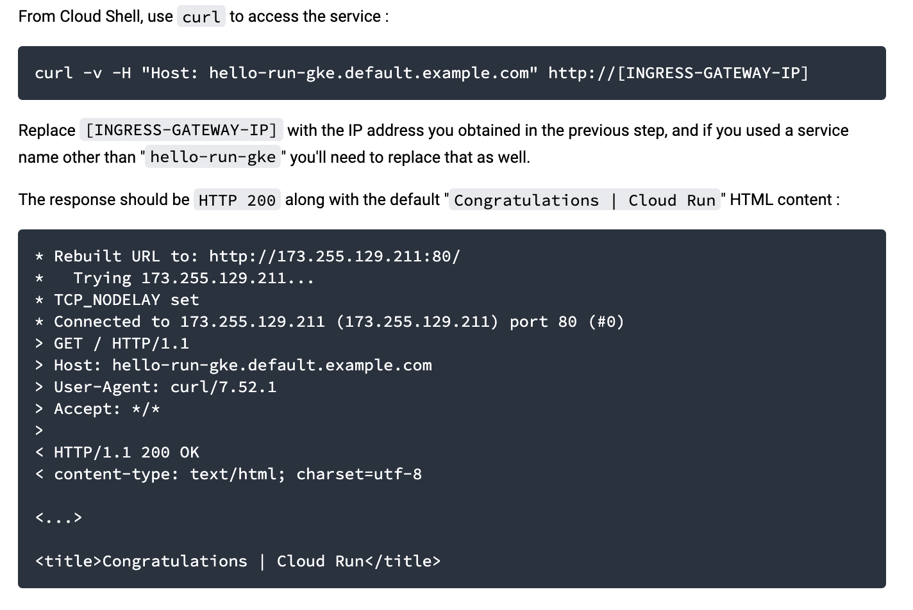

## Overview
Based on the cloudrun in GKE codelab https://codelabs.developers.google.com/codelabs/cloud-run-gke/index.html?index=..%2F..index#0

This directory is WIP

### Creating an cloud-run enabled cluster
NOTE: The console ui has changed significantly, so I need to figure out what the updated steps need to be. Below are screenshots from the outdated codelab.

