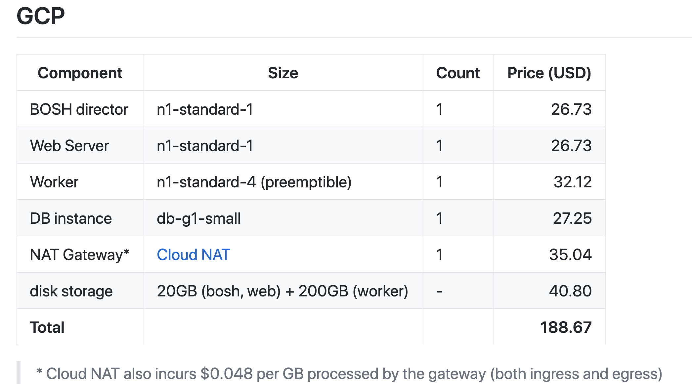

# Control Tower with GCP (WIP)
Easily run ConcourseCI in GCP. This workflow is based off documentation from https://concourse-ci.org/quick-start.html and https://github.com/EngineerBetter/control-tower/tree/0.12.2 and https://blog.alterway.fr/en/building-a-continious-deployment-pipeline-with-kubernetes-and-concourse-ci.html and https://github.com/concourse/hush-house and https://www.engineerbetter.com/blog/concourse-up-gcp/

## What Control Tower Does
control-tower first creates an S3 or GCS bucket to store its own configuration and saves a config.json file there.

It then uses Terraform to deploy the following infrastructure:

- GCP
  - A DNS A record pointing to the ATC IP
  - A Compute route for the nat instance
  - A Compute instance for the nat
  - A Compute network
  - Public and Private Compute subnetworks
  - Compute firewalls for director, nat, atc-one, atc-two, vms, atc-three, internal, and sql
  - A Service account for for bosh
  - A Service account key for bosh
  - A Project iam member for bosh
  - Compute addresses for the ATC and Director
  - A Sql database instance
  - A Sql database
  - A Sql user

## Cost
By default, control-tower deploys to the AWS eu-west-1 (Ireland) region or the GCP europe-west1 (Belgium) region, and uses spot instances for large and xlarge Concourse VMs. The estimated monthly cost is as follows:



## Setup

1. On GCP you must also ensure the following APIs are activated in your GCP project:

    * Compute Engine API (gcloud services enable compute.googleapis.com)

    * Identity and Access Management (IAM) API (gcloud services enable iam.googleapis.com)

    * Cloud Resource Manager API (gcloud services enable cloudresourcemanager.googleapis.com)

    * Cloud SQL Admin API (gcloud services enable sqladmin.googleapis.com)

2. A IAM Primitive role of roles/owner for the target GCP Project is required

3. Download the latest release of Control Tower

More info: https://github.com/EngineerBetter/control-tower/blob/master/docs/prerequisites.md

## Running
```
GOOGLE_APPLICATION_CREDENTIALS=<path/to/googlecreds.json> \
  control-tower deploy --iaas gcp <your-project-name>
```

