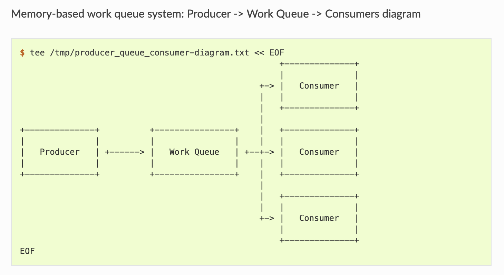

### Example job queue

https://multinode-kubernetes-cluster.readthedocs.io/en/latest/09-k8s-jobs.html 

#### Step 1 Create replicaset
Create a simple ReplicaSet to manage a singleton work queue daemon [replica set config file](configs/replica-set-queue.yaml)

```
kubectl apply -f configs/replica-set-queue.yaml
sleep 30
```

#### Step 2 Configure port forwarding
Configure port forwarding to connect to the ‘work queue daemon’ pod
```
QUEUE_POD=$(kubectl get pods -l app=work-queue,component=queue -o jsonpath="{.items[0].metadata.name}")

kubectl port-forward $QUEUE_POD 8080:8080 &
```

#### Step 3 Expose queue
Expose work queue - this helps consumers+producers to locate the work queue via DNS
Create the service pod using a configuration file
```
kubectl apply -f configs/service-queue.yaml
sleep 20
```

#### Step 4 Create queue
Create a work queue called ‘keygen’
```
curl -X PUT 127.0.0.1:8080/memq/server/queues/keygen
```

#### Step 5 Create work items and load queue
Create work items and load up the queue
```
for WORK in work-item-{0..20}; do curl -X POST 127.0.0.1:8080/memq/server/queues/keygen/enqueue -d "$WORK"; done
```

#### Step 6 Check queue status
Queue should not be empty - check the queue by looking at the ‘MemQ Server’ tab in Web interface (http://127.0.0.1:8080/-/memq)
```
curl --silent 127.0.0.1:8080/memq/server/stats | jq
```

#### Step 7 Create consumer job
Show consumer job config file allowing start up five pods in parallel. Once the first pod exits with a zero exit code, the Job will not start any new pods (none of the workers should exit until the work is done)

Create consumer job from config file
```
kubectl apply -f files/job-consumers.yaml
sleep 30
```

#### Step 8 Check pods' status
Five pods should be created to run until the work queue is empty. Open the web browser to see changing queue status (http://127.0.0.1:8080/-/memq)
```
kubectl get pods -o wide
# Check the queue status - especially the ‘dequeued’ and ‘depth’ fields
curl --silent 127.0.0.1:8080/memq/server/stats | jq
```

#### Cleanup
```
# Stop port forwarding
pkill -f "kubectl port-forward $QUEUE_POD 8080:8080"
# Clear the resources
kubectl delete rs,svc,job -l chapter=jobs
```
