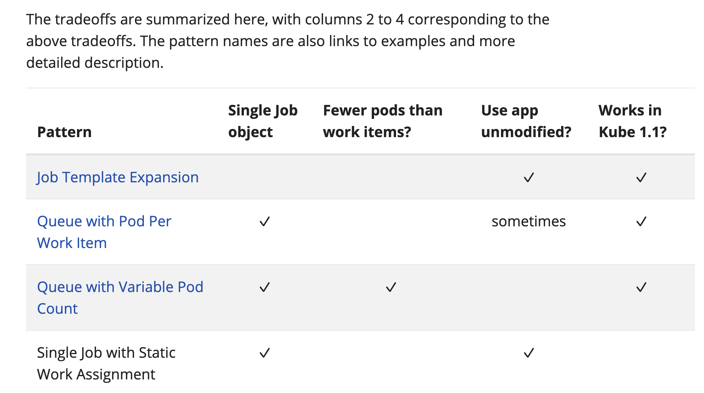
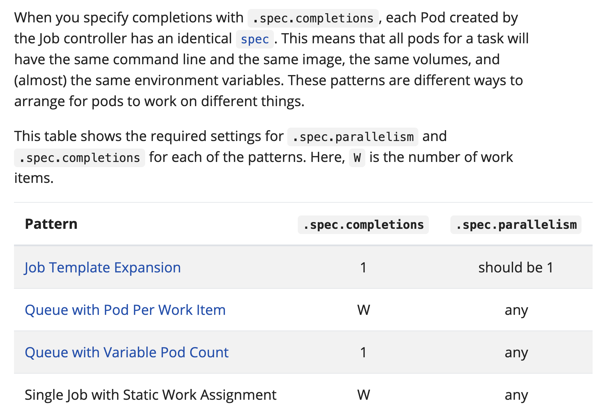

There are several different patterns for parallel computation, each with strengths and weaknesses. The tradeoffs are:

One Job object for each work item, vs. a single Job object for all work items. The latter is better for large numbers of work items. The former creates some overhead for the user and for the system to manage large numbers of Job objects.
Number of pods created equals number of work items, vs. each Pod can process multiple work items. The former typically requires less modification to existing code and containers. The latter is better for large numbers of work items, for similar reasons to the previous bullet.
Several approaches use a work queue. This requires running a queue service, and modifications to the existing program or container to make it use the work queue. Other approaches are easier to adapt to an existing containerised application.

