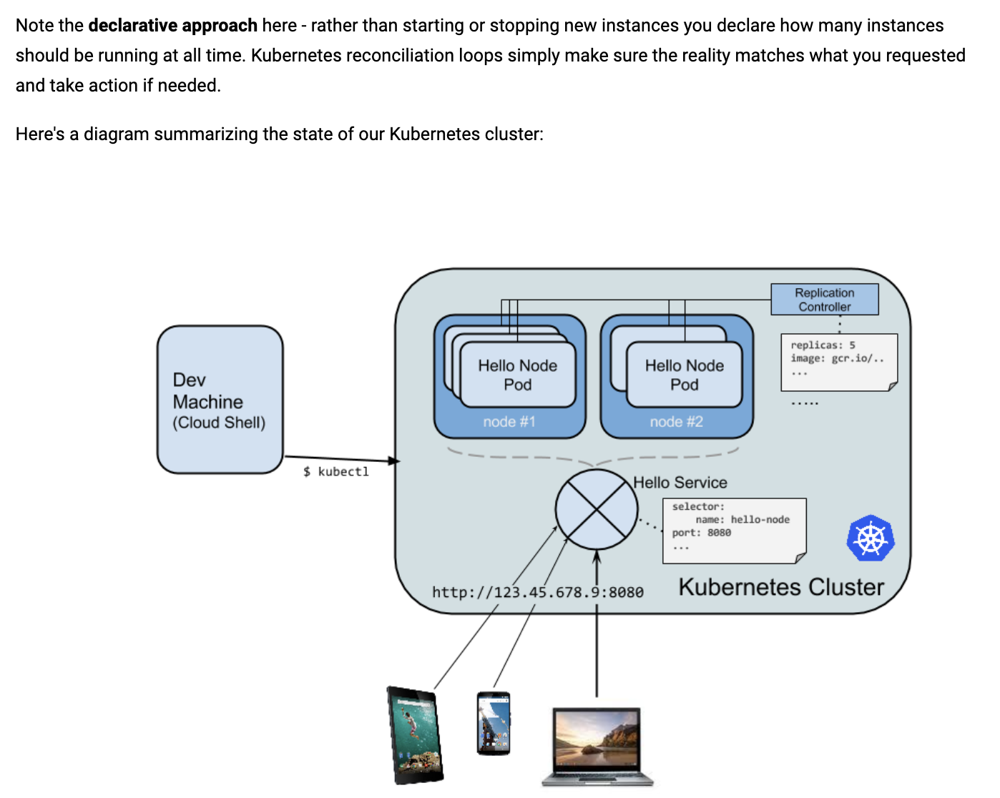

# Run a Nodejs container in GKE
Based on codelabs https://codelabs.developers.google.com/codelabs/cloud-running-a-nodejs-container/index.html?index=..%2F..index#1 and https://codelabs.developers.google.com/codelabs/cloud-hello-kubernetes/index.html?index=..%2F..index#5

The a copy of the application code is in [containerengine](containerengine)

### How to run
Run the commands in [nodejs-container.sh](nodejs-container.sh)

### Notes
1. This publishes the container to Google Container Registry
2. Typically, you would create a yaml file with the configuration for the deployment. In this example, we are going to skip this step and instead directly create the deployment in the command line.
3. This takes a declarative approach to scaling

### Resources
1. Best practices for building containers https://cloud.google.com/solutions/best-practices-for-building-containers
2. Performing rolling updates https://kubernetes.io/docs/tutorials/kubernetes-basics/update/update-intro/