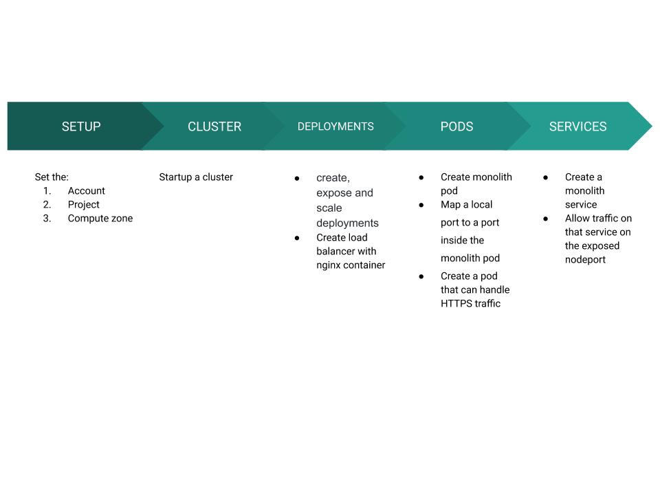
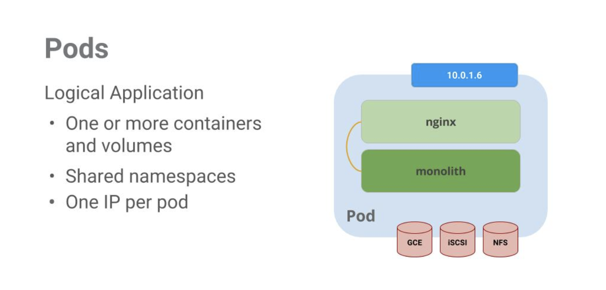
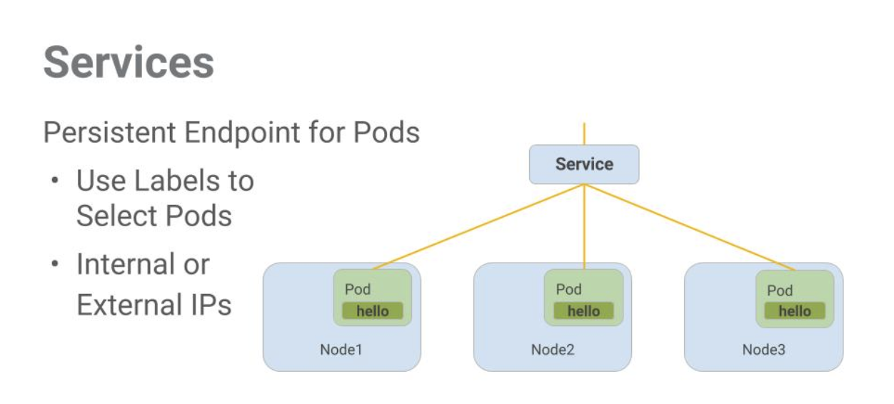
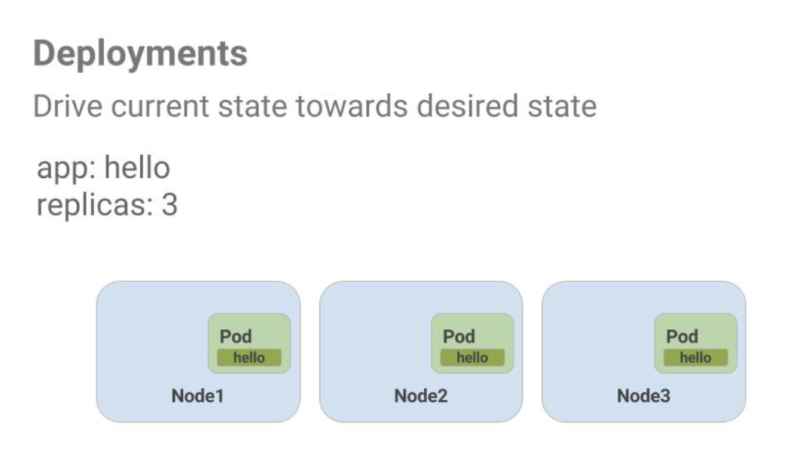
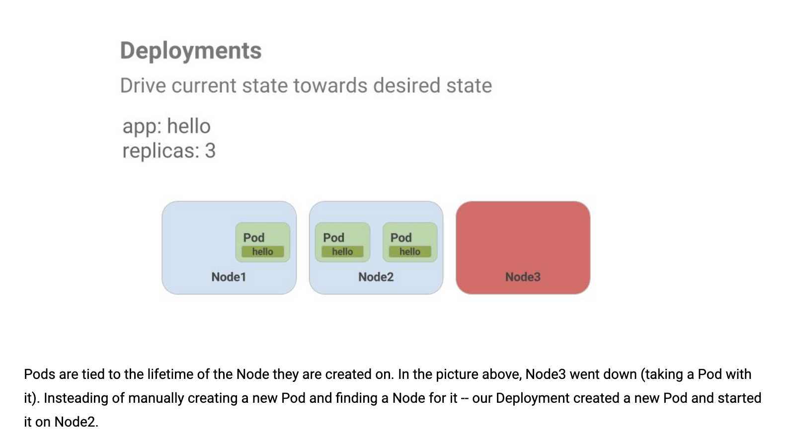

## Overview
These are notes based on the GCP code lab:
https://github.com/googlecodelabs/orchestrate-with-kubernetes 
https://codelabs.developers.google.com/codelabs/cloud-orchestrate-with-kubernetes/index.html?index=..%2F..index#13 

There are additional helpful commands that the codelab doesn't go through, but the github repo contains. I included the ones that I found most useful in markdown docs in the additional-workflows directory.

It involves the following:
NOTE: the diagram below is WIP

The commands that were in the codelab are in gke-infra.sh, including line comments

Some of the commands in the code lab were outdated, so this practice repo includes some updated lines of code. I completed the lab in the GCP Cloud Shell, but they should be the same commands in your local terminal.

## Features
### Pods

Pods can be created using pod configuration files. In the case of the example, monolith.yaml

### Services

### Deployments

